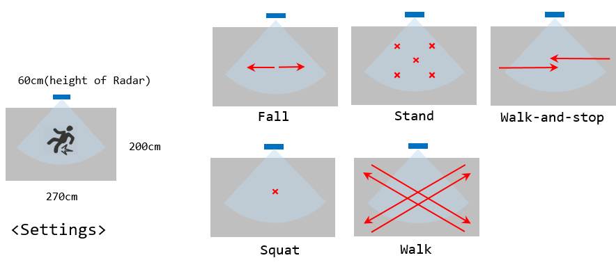
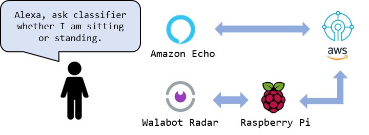
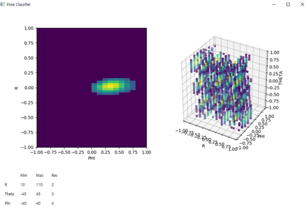

# A Commercial Radar based Fall Detection using 4D CNN

**본 과제는 과학기술정보통신부에서 시행한 정보통신,방송연구개발사업의 결과입니다.**

THIS PROJECT IS STILL A WORK-IN-PROGRESS.

A radar is known as a proper platform for fall detection because camera violates privacy and wearable sensors are often bulky. Since a conventional motion detection algorithm for radar data struggles to classify complex falls, some studies adopted deep learning techniques. Instead of manipulating raw radar signals, one can generate 3D radar image ((Range, Phi, Theta) or (x, y, z)) out of raw signals and benefit from existing CNN architecture in computer vision. Although a series of 3D radar image are natural fit for 4D-CNN, to the best of our knowledge, this work first demonstrates the feasibility of 4D-CNN on radar data.

## Fall Detection
**/fall_detection**: (preliminary) 1)a fall detection data set generator that creates both 2d(R, Phi) and 3d(R, Phi, Theta) radar image using Walabot's getRawImageSlice function and getRawImage function for fall and various non-fall activities. 2)3D-CNN model(for both 2d and 3d radar data) that correctly classifies fall and non-falls.

Code based on [Tutorial-about-3D-convolutional-network](https://github.com/OValery16/Tutorial-about-3D-convolutional-network)

Code for ConvNd from [convNd and convTransposeNd in Pytorch](https://github.com/pvjosue/pytorch_convNd)

  

## For fun...
### Alexa, Walabot Integration
**/alexa_popsture_classifier**: a complete alexa controlled posture classifier(standing or sitting) using a Walabot and a simple fully connected neural network.

  

### Radar Image GUI
**/2d_3d_gui**: GUI that contains both 2d and 3d analysis of Walabot.

  

